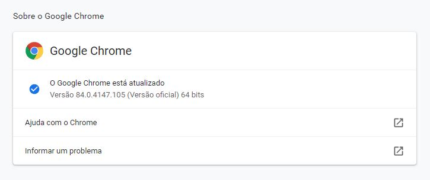
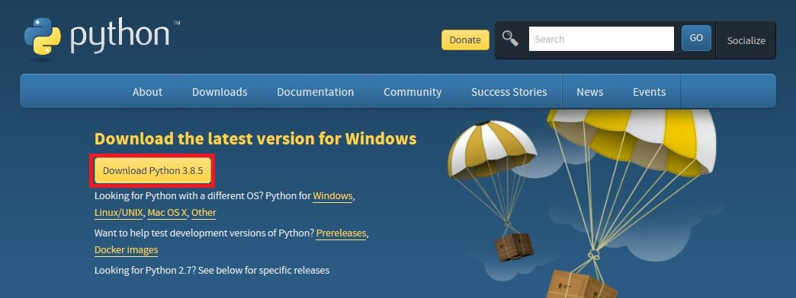
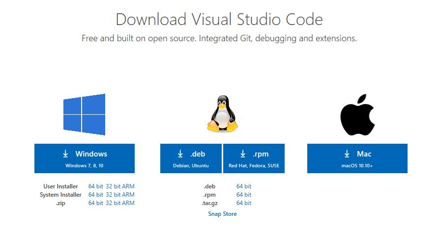
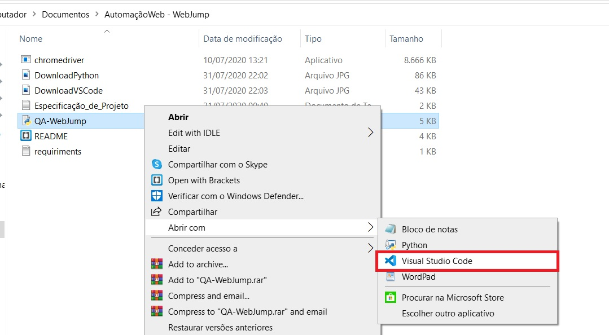
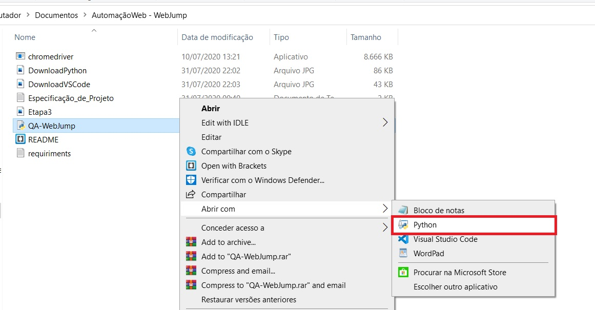

<h1>
    <div align='center'>Teste WebJump - Analista de QA</div>
</h1>
<div align='center'>
    
    
    
</div>
</br>

### Índice :scroll: 
- Ferramentas
- Instalação do Selenium WebDriver
- Download e Armazenamento ChromeDriver
- Executando os Testes
- Links

### Ferramentas :wrench:

&nbsp;&nbsp;&nbsp;&nbsp;&nbsp;&nbsp;Para o desenvolvimento desse software, foram utilizadas as ferramentas listadas a seguir:


- Windows 10 Home Single Language
- [Visual Studio Code 1.47.3](https://code.visualstudio.com/download)
- [Python 3.8.3](https://www.python.org/downloads/)
- [ChromeDriver 84.0.4147.30](https://sites.google.com/a/chromium.org/chromedriver/downloads)
- [Selenium WebDriver](https://selenium-python.readthedocs.io/installation.html#)

##### &nbsp;&nbsp;&nbsp;&nbsp;&nbsp;&nbsp;Obs: Clicando sob cada item que contém hiperlink, você será redirecionado para a página de download.

### Instalação do Selenium WebDriver :computer:
&nbsp;&nbsp;&nbsp;&nbsp;&nbsp;&nbsp;Na programação, foi utilizada a biblioteca Selenium WebDriver, pois com ela é possível identificar e manipular os elementos dentro da página. Segue abaixo informações referente à instalação do framework e sua documentação:
- [Selenium WebDriver](https://selenium-python.readthedocs.io/)</br>O Selenium WebDriver pode ser instalado de diversas maneiras. O método utilizado nesse caso foi seguindo os passos abaixo:
1. Acesse o prompt de comando `'win'` + `'r'`
3. Digite "cmd" e depois pressione `'enter'`
2. Digite e execute o seguinte comando: `py -m pip install selenium`

##### Obs: Para esse comando funcionar, é necessário que o usuário já tenha instalado em sua máquina o Python 3.8.3

### Download e Armazenamento ChromeDriver :file_folder:
&nbsp;&nbsp;&nbsp;&nbsp;&nbsp;&nbsp;Para a instalação do ChromeDriver, é necessário saber qual é a versão do seu navegador. Para desconbrir essas informações, siga os passos a seguir:
1. No Google Chrome, vá em 'Configurações', no canto superior direito;
2. Clicando nele, é possível verificar à esquerda, uma lista de configurações;
3. Clique em 'Sobre o Google Chrome';
4. Serão carregados as seguintes informações:
   <div align='center'>
    
   <div>
5. Para realizar o download correto, acesse o link, clicando [aqui](https://sites.google.com/a/chromium.org/chromedriver/downloads).
6. Escolha a versão do seu Chrome e clique na opção;
7. Automaticamente o seu download irá começar.
       
 ##### Obs: Não esqueça de colocar o chromedriver dentro da pasta onde estão os demais arquivos do programa.

### Executando os Testes :arrow_forward:
&nbsp;&nbsp;&nbsp;&nbsp;&nbsp;&nbsp;Para executar os testes é muito simples, primeiro de tudo, baixe todos os arquivos e armazene-os na mesma pasta. Feito isso, siga os passos a seguir:

1. Instale o Python 3.8.3, para poder executar o programa;
   <div align='center'>
    
   <div>
2. Instale o Visual Studio Code 1.47.3 no seu computador, para a edição do código;
   <div align='center'>
    
   <div>
3. Abra o arquivo "QA-WebJump.py" com "Visual Studio Code";
   <div align='center'>
    
   <div>
4. Vá até as últimas linhas do código e realize as tarefas conforme comentado.
   ###### Obs: Para a realização dos testes, deve-se descomentar a classe e seu respectivo "executa cenário"

    4.1. Para executar o teste 1: 
    ```(Python)
    CB = ClickButtons() #CLASSE DO CENÁRIO 1 
    #CIF = ClickIFrameButtons() #CLASSE DO CENÁRIO 2
    #LS = LastScene() #CLASSE DO CENÁRIO 3
    CB.run() #EXERCUTA CENÁRIO 1
    #CIF.run() #EXECUTA CENÁRIO 2
    #LS.run() #EXECUTA CENÁRIO 3
    ```

    4.2. Para executar o teste 2:
    ```(Python)
    #CB = ClickButtons() #CLASSE DO CENÁRIO 1 
    CIF = ClickIFrameButtons() #CLASSE DO CENÁRIO 2
    #LS = LastScene() #CLASSE DO CENÁRIO 3
    #CB.run() #EXERCUTA CENÁRIO 1
    CIF.run() #EXECUTA CENÁRIO 2
    #LS.run() #EXECUTA CENÁRIO 3
    ```

    4.3. Para executar o teste 3:
    ```(Python)
    #CB = ClickButtons() #CLASSE DO CENÁRIO 1 
    #CIF = ClickIFrameButtons() #CLASSE DO CENÁRIO 2
    LS = LastScene() #CLASSE DO CENÁRIO 3
    #CB.run() #EXERCUTA CENÁRIO 1
    #CIF.run() #EXECUTA CENÁRIO 2
    LS.run() #EXECUTA CENÁRIO 3
    ```


5. Após determinar qual teste será realizado, salve o arquivo "QA-WebJump.py", utilizando o comando `'ctrl'`+`'s'`;
6. Abra-o com o Python e veja o funcionamento do programa com o cenário escolhido! 

   <div align='center'>
    
   <div>

### Links :link:

- Tutorial para instalação do Python: https://www.youtube.com/watch?v=UI2OKHxLWfg
- Tutorial para instalação do Visual Studio Code: https://www.youtube.com/watch?v=49K-Zxc8A7A
</br>
Documento desenvolvido em Markdown Markup Language.
